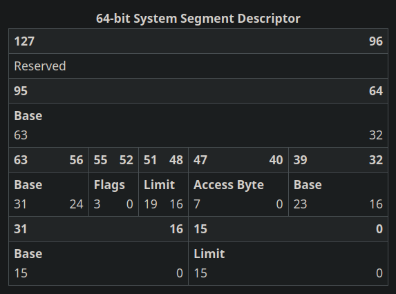

# Custom-Kernel

Writing from scratch in C and Assembly.

## Early Kernel Bootstrapping and Long Mode Initialisation
### 1. Module Overview

The target directory: ``` src/boot ```.  
The ```boot.asm``` module serves as the primary entry point for my custom x86_64 kernel. Since the [__Multiboot2 specification__](https://www.gnu.org/software/grub/manual/multiboot2/html_node/Machine-state.html) requires the bootloader to transfer control to a 32-bit operating system in Protected Mode with paging disabled, while leaving critical execution state such as the stack pointer and descriptor tables undefined, an assembly bootstrap stub is required to establish the minimal execution environment needed before higher-level kernel code can execute.  
Its primary duties include:  

1. Validating the image via a Multiboot2 compliant signature.
2. Configuring a temporary early-boot stack.  
3. Constructing a basic 4-level paging hierarchy to map early physical memory.  
4. Transitioning the CPU control state from 32-bit Protected Mode into 64-bit Long Mode.  
5. Initialising the execution segment registers and aligning the stack to conform to the System V AMD64 ABI before jumping into C code — ```kernel_main()``` in ```kernel.c```.  

### 2. Multiboot2 Header Verification

```
MAGIC    equ 0xe85250d6
ARCH     equ 0           ; x86
HDRLEN   equ header_end - header_start
CHECKSUM equ -(MAGIC + ARCH + HDRLEN)
```

__Magic Number__ ```0xe85250d6``` identifies this binary as Multiboot2 executable.  
__Architecture__ ```0``` signals to the bootloader that the kernel expects to be initialised in i386 32-bit Protected Mode.  
__Header Length__ and __Checksum__ formally validate the structural integrity of the block, by ensuring that the bootloader fields sum to exactly zero.  
[__Reference for values__](https://www.gnu.org/software/grub/manual/multiboot2/html_node/Header-magic-fields.html)

### 3. Early Page Table Construction and Identity Mapping

Before 64-bit execution can be toggled via control registers — ```cr0-cr6``` — the x86_64 architecture requires paging to be active, and a valid 4-level transition tree must be present in the CPU, [__source__](https://stackoverflow.com/questions/77665641/x86-64-running-in-long-mode-64-bit-submode). ```boot.asm``` reservers three contiguous 4096-byte blocks within uninitalised data storage (```.bss```) to build the initial page layout.  

``` 
section .bss
align 4096
pml4_table: resb 4096
pdpt_table: resb 4096
pd_table:   resb 4096
align 16 
stack_bottom: resb 16384
stack_top:
```

1. ```pml4_table```: Page Map Level 4. The first entry is pointed directly to the base physical address of ```pdpt_table```, combined with control flags ```0b11``` — __Present__ and __Read/Write__.
2. ```pdpt_table```: Page Directory Pointer Table. The first entry is pointed to the physical address of ```pd_table```, also flagged with ```0b11```.  
3. ```pd_table```: Page Directory. Rather than managing the fourth tier of mapping (Page Tables) for granular 4KB allocations, the kernel establishes optimised 2MB Huge Pages by setting Page Size (bit 7) directly within the Page Directory entries. 

Setup loop maps the first 16MB of physical memory: 

```
; Link PD entry 0 to a 2MB Huge Page (starts at address 0)
    mov ecx, 0          ; index
    mov ebx, 0          ; physical addr

    .map_loop:
        mov eax, ebx
        or eax, 0b10000011
        mov [pd_table + ecx*8], eax

        add ebx, 0x200000    ; next 2MB
        inc ecx
        cmp ecx, 8           ; map 16MB
        jl .map_loop
```

Identity mapping is vital as the physical location of the code currently executing the memory must correspond exactly to its virtual block. If the virtual address doesn't map directly to the physical address, the instruction pointer would fetch arbitrary instructions when paging is enabled, resulting in a CPU crash.  

### 4. Hardware Long Mode Execution 

The steps to toggling the processor from 32-bit architecture to 64-bit follows:  

1. The physical starting address of ```pml4_table``` is loaded into the translation base (```cr3```) register. 
2. Bit 5 of the physical address translation (```cr4```) register is flagged. Physical address translation changes the width of the page table records from 32-bits to 64-bits to accommodate for the wider physical address pointers.  
3. The kernel queries the Extended Feature Enable Register (EFER) at address `0xc0000080` via the `rdmsr` instruction. It sets bit 8 (Long Mode Enable), and writes it back to the CPU execution core using `wrmsr`.  
4. Bit 31 of `cr0` register (Paging - PG) is flagged. Soon after, the Memory Management Unit begins translating all the memory operations using the loaded PML4 tree.  
5. Although paging is active, the internal execution segment cache is still operating user 32-bit limits. To resolve this, a preliminary Global Descriptor Table layout `gdt64.layout` is loaded via `lgdt`, followed by an explicit long jump `jmp gdt64.code:long_mode_start`. This flushes the processor prefetch queue and locks the instruction decoder into native 64-bit execution.  

### 5. Execution Environment Sanitation and ABI Handover  

These are just cleanup measures that are taken to ensure platform predictability. This entails clearing out segment registers (ie. setting them to `0`). Also, stack pointer realignment, where `rsp` is moved to `stack_top` and the lowest 4 bits are cleared to align it with the new architecture. And finally, permanent kernel handoff via `call kernel_main` which is in `kernel.c`.  

## CPU Architecture Configuration and Segment Lifecycle Management  

### 1. Architectural Overview  

Note that though `boot.asm` establishes a temporary state to execute 64-bit code, it doesn't configure any kind of finalised execution environment. This module `src/cpu` establishes important hierarchies including User and Kernel spaces, setting up a Hardware Task Management System for safe transitions, and managing interruptions (IDT/ISR) to trap processor exceptions, timer ticks, and hardware interrupts.  

### 2. Segment Control and Ring Isolation (Global Descriptor Table)


__Note that the 64-bit System Segment Descriptor can be represented as a C struct:__

```
typedef struct __attribute__((packed)) {
    uint16_t limit_low;
    uint16_t base_low;
    uint8_t base_mid;
    uint8_t type;
    uint8_t limit_high_flags;
    uint8_t base_high;
    uint32_t base_upper;
    uint32_t reserved;
} tss_descriptor_t;
```

The __Base Address__ represents where the Task State Segment (TSS) is located in memory. Note that the address is split into four sections: `base_low`, `base_mid`, `base_high`, and `base_upper` — all adding up to a 64-bit value.  
The __Limit__ is the size of the TSS descriptor. Follows a similar seperation pattern as __Base Address__ but instead this will add up to a total of 20 bits. Notice that the last 4 bits of __Limit__ is combined with the __Flag__ bits, this is done as to avoid C bitfields and their related compiler uncertainty issues — endianness and bitfield ordering.  
The __Type__ bits (Access Byte) are used  

### TODO ^ 


Loading a new GDT layout into memory via `lgdt` doesn't immediately update the CPU's internal cached segment states. The kernel executes `gdt_flush.asm` to enforce those boundaries. This process simply just loads the GDT pointer, overwrites the data selectors with Ring 0 data token `0x10`, and then those code segments are reloaded with the proper privileges. 

### 3. Privilege Ring Escalation Security (Task State Segment)

In 64-bit mode, the Task State Segment (TSS) hardware task-switching features are deprecated. Instead, the TSS serves to define the target stack pointer during unprivileged (user) ring transition.  
When a Ring 3 user process triggers a hardware interrupt, exception, or system call (syscall) instruction, the CPU must immediately leave the (untrusted) user stack and jump to a secure kernel-allocated stack area to execute the associated handler.  
A more technical perspective: 
- The kernel populates `tss.rsp0` field with the physicall address of the executing process's private kernel stack frame. 
- When an exception or syscall triggers a transition into Ring 0, the CPU's execution unit reads `tss.rsp0` from the active task block, automatically swaps the stack pointer `rsp` to the safe address, and he user's original stack parameters `ss` `rsp` are pushed onto it for a clean return later.  

### 4. Interrupt Routing and Exception De-multiplexing (Interrupt Descriptor Table)  

The Interrupt Descriptor Table is what the CPU uses to located the correct handler routine when an exception or hardware interrupt fires. Each of the 256 possible interrupt vectors maps to a unique gate descriptor that encodes the handler's address, privilege level, and gate type:  

```
typedef struct __attribute__((packed)) { 
    uint16_t offset_low; 
    uint16_t segment_selector; 
    uint8_t  ist; 
    uint8_t  type_attr;
    uint16_t offset_mid; 
    uint32_t offset_high; 
    uint32_t zero; 
} idt_entry_t; 
```
The `type_attr` field controls the gate type — `0xE` for an interrupt gate. 


## Running the Code
### Libs
```
sudo apt install build-essential nasm gcc-x86-64-linux-gnu \
    binutils-x86-64-linux-gnu musl-tools grub-pc-bin \
    grub-common xorriso qemu-system-x86 mtools
```
### Running the system
```
../Custom-Kernel$ make clean && make && make run
```
```
../Custom-Kernel$ make clean && make debug && make run
```
```
../Custom-Kernel$ make clean && make test && make run
```
### What is the GDT
The Global Descriptor Table (GDT) is a table in memory that defines memory segments, providing context to which segments are allowed to perform certain actions --- privilege rings. Ring 0 is called the kernel mode which has full hardware access and ring 3 is the user mode which has certain restrictions.cIn the modern day the GDT is mostly just a formality --- which must still be loaded correctly --- the CPU requires before the OS is able to do anything of use.  

### IDT and Interrupt Stubs 
The Interrupt Descriptor Table (IDT) is the CPU's lookup table for handing interrupts and exceptions. When anything unexpected happens --- divide 0, page fault, timer firing, keypress --- the CPU stops what it's doing and has to handle the interrupt type by look it up on the table. 
There are 256 possible entries. 0-31 are CPU exceptions, 32-47 are hardware interrupts, 48+ are for syscalls. 

Each entry of the table must point to an assembly stub because the CPU pushes specific things onto the stack when an interrupt fires and expects a specific ```iretq``` call after the interrupt. An example of an assembly stub is just a small ```.asm``` file containing a small set of instructions; the goal is to not write the entire system is assembly. 

### ROADMAP 
- Complete user space 
    - SYS_READ: blocking keyboard input to a user buffer. User process calls, kernel blocks the process until the key arrives, wakes the process and returns the char. 
    - SYS_SLEEP: yield for ```n``` ticks. Kernel sets a wake-up tick and then sets it as PROCESS_BLOCKED until time to start again. 
    - PROCESS_BLOCKED: ... 
    - SYS_SBRK: lets the user process call malloc. Implement sbrk as a syscall that bumps a per-process heap pointer and maps new pages. Then a minimal malloc/free in ulib builds on top of it. 
- Graphics 
    - Consider VESA/VBE for better colours/resolution. 
    - Double buffering: user process draws to a back buffer in its own memory, then syscall to blit it to the real framebuffer. Supposedly prevents tearing issues. 
- Storage and filesystem 
    - If i want to run and load games, i will need a file system.
- ELF loader
- Load up DOOM from doomgeneric and map all ports and elements.  

### BUGS TO ADDRESS
> When you init the process scheduler with just a user process, the scheduler will bug out after the first print. The same doesn't happen when I start with a kernel process and append a user process after in the scheduler.
 
> Technically not a bug; change files to be cleaner, for example I have to keep adding header files all across different sections. I need to find a cleaner method for sharing information between different 'modules'. E.g Scheduler has ```scheduler_wake_key_waiter()``` which I then have to link in ```keyboard.c```.

> I need to init a kernel level process A before being able to also run process pong. Adding onto that, pong will run for a while in this state then it will just pause --- perhaps crashing. 

> Add comments to EVERYTHING

> Remove magic numbers in all code.

> Add testing for folders: user, filesystems, ... 

> Include more error resolution/print statements in oth vga & serial. 